<div align="center">

# Gym Management System


A PHP-based application crafted to optimize and simplify gym management. It offers an intuitive interface for efficiently managing memberships, tracking attendance, processing billing, and scheduling classes, ensuring seamless operation and enhanced member satisfaction.
</div>

## Features
- Member Management: Add, update, and delete member profiles, track memberships, and manage renewals.
- Attendance Tracking: Record and monitor daily attendance with creating session for them.
- Program Management: Add ,update and delete program and exercise and assign programs to the users.
- Reports: Generate detailed reports on member activity, and class attendance.

## Requirements
- PHP 7.4 or higher
- MySQL 5.7 or higher
- Apache or Nginx web server

## Installation
### 1- Clone the repository
```shell
git clone https://github.com/seyed0123/gym.git
cd gym
```
### 2- Set up the database
- Install the mysql composer lib.
- Create a MySQL database.
- enter the database info in the [db](php/db_connect.php) file.
- create tables using [table](table.sql) file

### 3- Setup admin user
- set the admin username and password in the [admin](admin.json) file
- default admin username and password is (username = `admin` , passwords =`1234`)
- you can generate the admin password hash using [test](test.php) file.

## Database
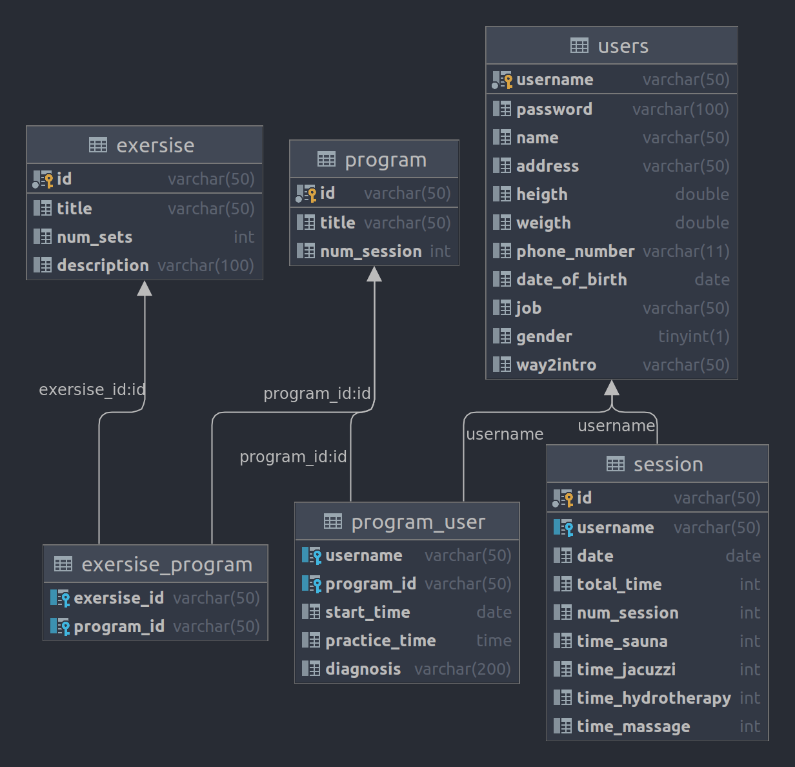

## Screenshots
### login
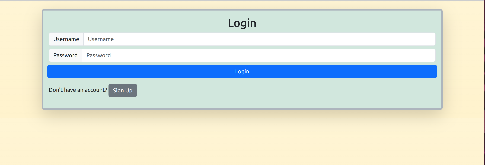
### sign up
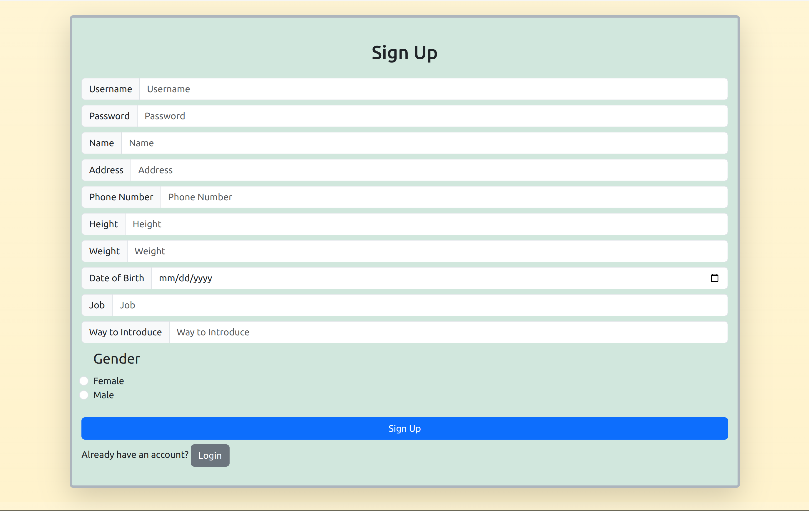
### user
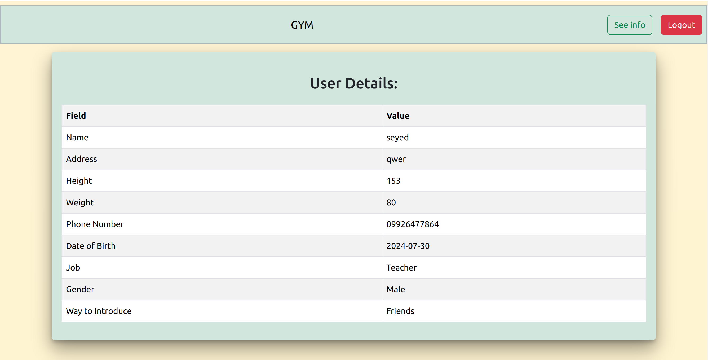
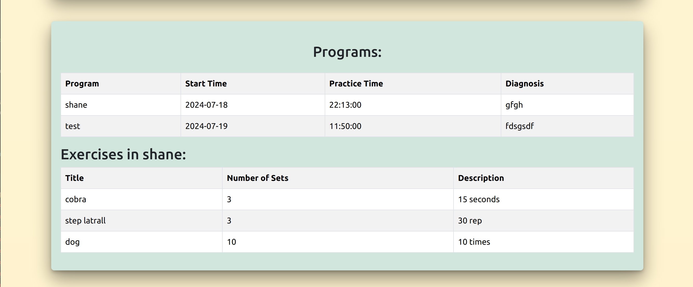
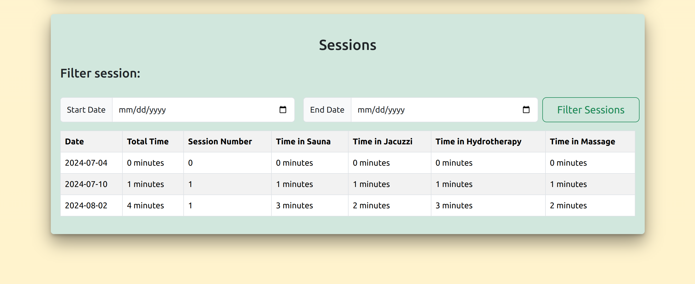
### admin

#### new session
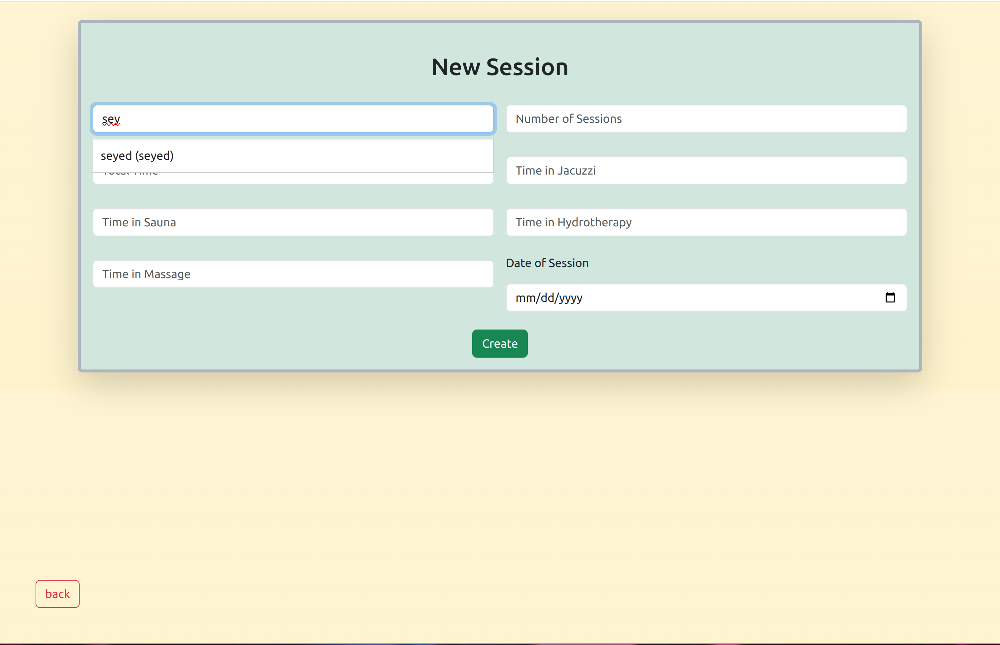
#### search user
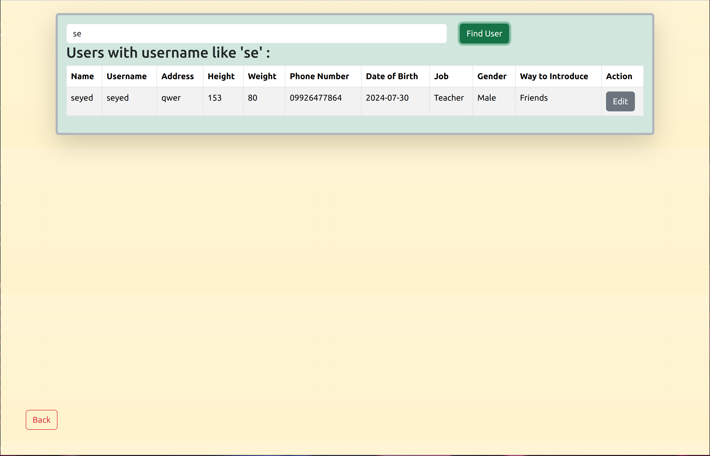
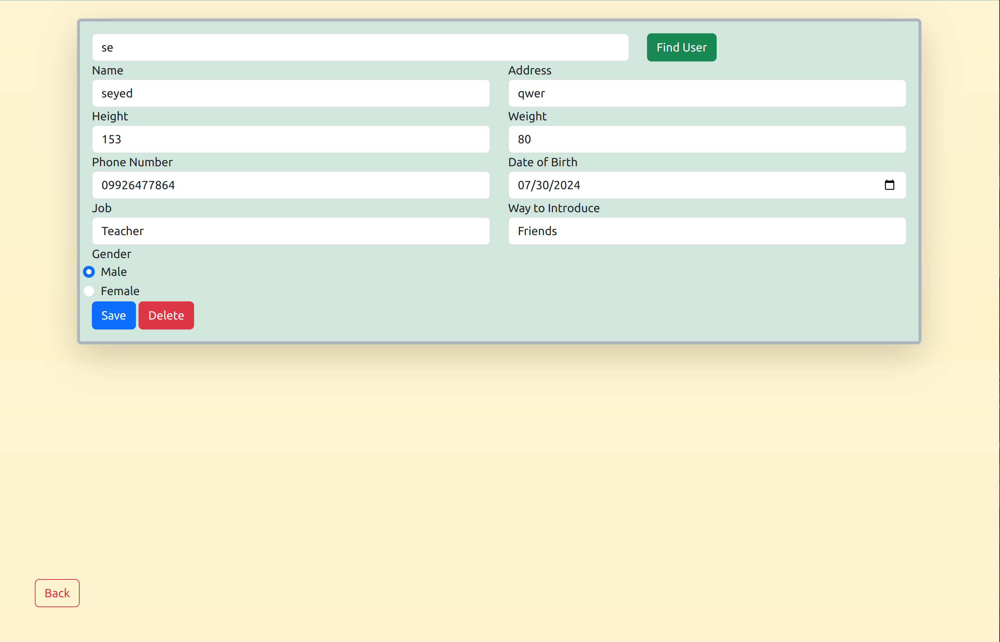
#### new program
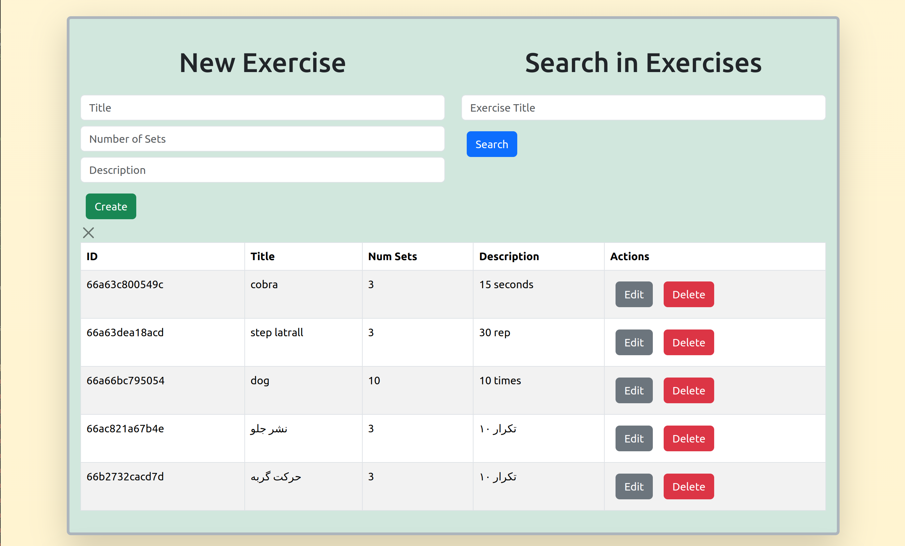
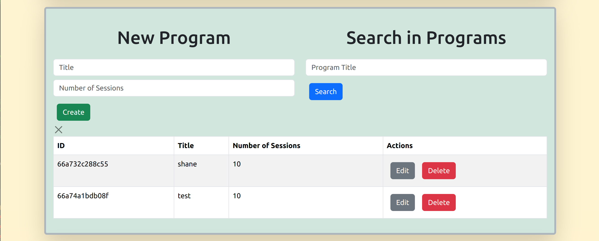
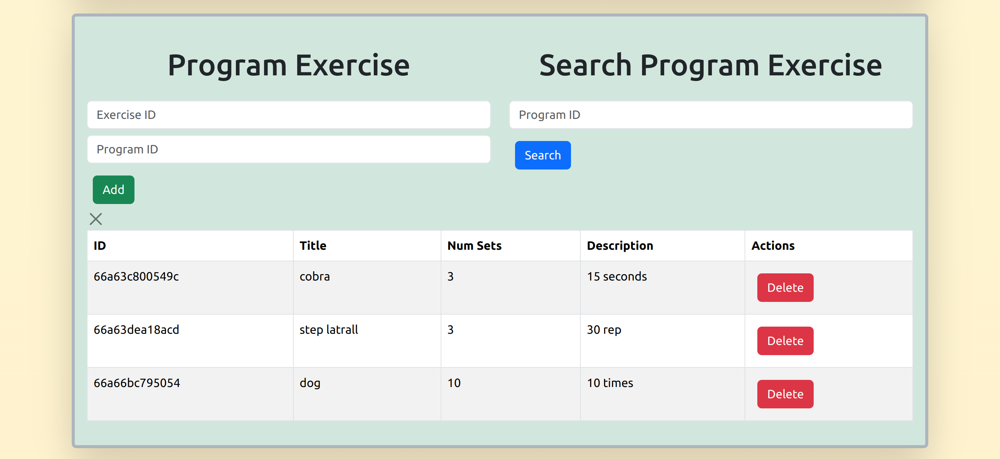
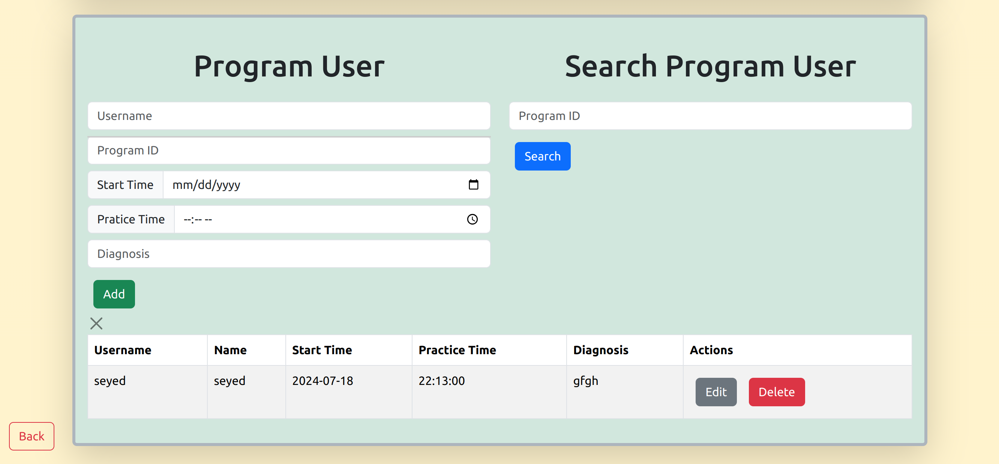
### **The site support the mobile view as well**
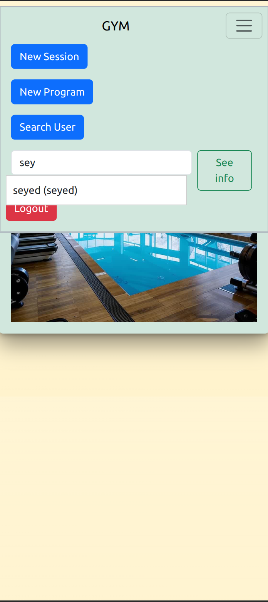
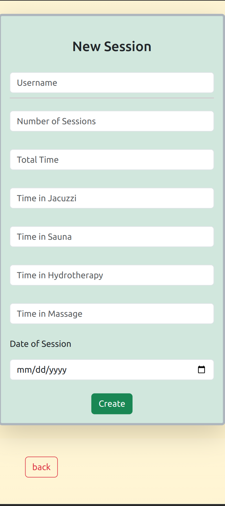

##Contributing
feel free to send the pull requests 
